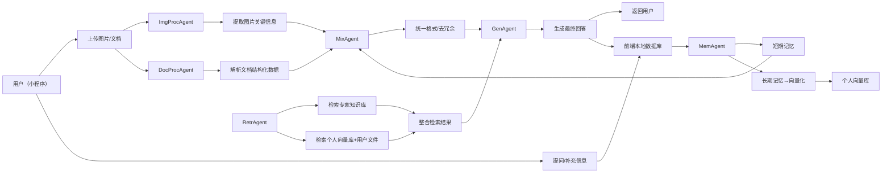

# TO DO

- ## 知识库构建(knowledge_base)

- [X] 文档加载器
- [X] 文档解析器
- [X] 嵌入模型
- [X] 向量存储
- [X] 专家知识库
- [ ] 用户个人知识库
  - [ ] 孕妇个人数据库（MySQL）

- ## 提示词工程

- [X] LLM提示词工程
  - [X] 使用小模型进行提示词模板选择(all-miniLM-L6-v2)
- [X] Rag提示词工程

- ## LLM模块

- [ ] 本地大模型调用
  - [ ] RLHF(使用GSPO强化学习算法对模型进行微调)
- [X] 云端大模型调用

- ## RAG模块

- [X] 检索模块
  - [X] 专家知识库检索
  - [ ] 用户个人知识库检索
- [X] 生成
  - [ ] 结合两个知识库检索内容进行生成
- [ ] 后处理
- [ ] 链

- ## 评估模块

- [ ] 评估指标
- [ ] 检索模块评估
- [ ] 生成模块评估
- [ ] 用户反馈分析

